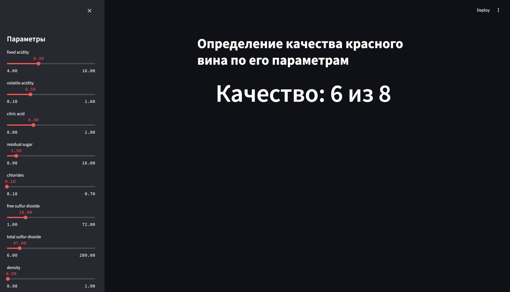

# MLOps. Итоговый проект.

Цель проекта: разработать конвеер машинного обучения data-продукта (Web или API приложение).

Требования к реализации проекта:

- Исходные коды проекта должны находиться в репозитории GitHub.
- Проект оркестируется с помощью ci/cd (jenkins или gitlab).
- Датасеты версионируются с помощью dvc и синхронизируются с удалённым хранилищем.
- Разработка возможностей приложения должна проводиться в отдельных ветках, наборы фичей и версии данных тоже.
- В коневеере запускаются не только модульные тесты, но и проверка тестами на качество данных.
- Итоговое приложение реализуется в виде образа docker. Сборка образа происходит в конвеере.
- В проекте может использоваться предварительно обученная модель. Обучать собственную модель не требуется.

## Описание приложения

Приложение предназначено для определения качества вина по восьмибальной шкале на основании заданных параметров.

Пример интерфейса приложения:



## Ресурсы

- [Ноутбук с экспериментами](notebooks/project.ipynb)
- [Обученная модель](models/model.pkl)

## Установка зависимостей и запуск приложения

Список зависимостей расположен в файле [requirements.txt](requirements.txt)

Для установки зависимостей можно выполнить команду:

```shell
pip install -r requirements.txt
```

Приложение запускается командой:

```shell
streamlit run app.py
```

## Запуск тестов

Для запуска тестов требуется выполнить:

```shell
pytest
```

## Развёртывание приложения

Развернуть в Docker:

```shell
make up
```

Остановить и удалить контейнеры:

```shell
make down
```

## Лицензия

[Лицензия MIT](https://mit-license.org/)

Copyright © 2024 Иноземцев И.В.

